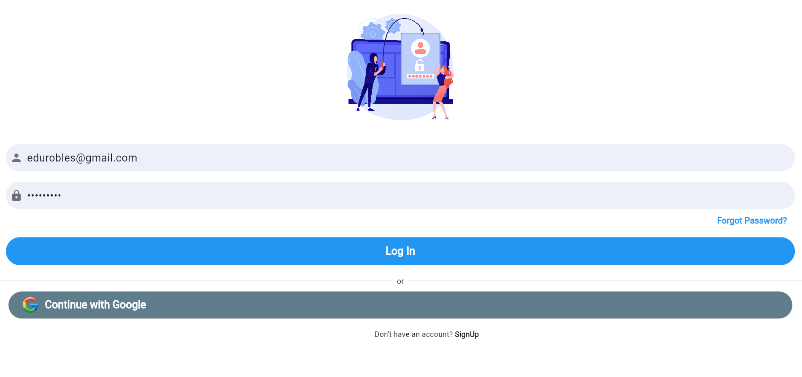
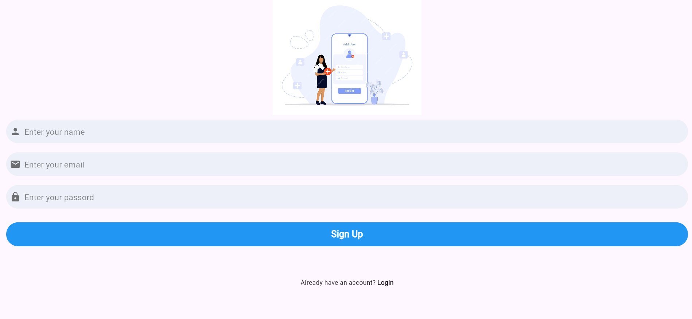

# Flutter Login & Sign Up App


Este proyecto es una aplicación de Flutter que incluye funcionalidades de inicio de sesión (login) y registro (sign up). La aplicación está diseñada para ser una base para cualquier proyecto que necesite autenticación de usuario.

## Características

- Login con correo electrónico y contraseña.
- Registro de nuevos usuarios.
- Validación de formularios.
- Integración con Firebase Authentication (opcional).
- Diseño responsivo y amigable.

## Capturas de Pantalla




## Requisitos Previos

- Flutter SDK: [Flutter installation guide](https://flutter.dev/docs/get-started/install)
- Un editor de código como [Visual Studio Code](https://code.visualstudio.com/) o [Android Studio](https://developer.android.com/studio)

## Empezando

Sigue estos pasos para obtener una copia del proyecto y ejecutarlo en tu máquina local.

### Instalación

1. Clona este repositorio:

   ```bash
   git clone https://github.com/tu-usuario/flutter-login-signup.git
   cd flutter-login-signup
   ```

2. Instala las dependencias:

   ```bash
   flutter pub get
   ```

3. Ejecuta la aplicación:

   ```bash
   flutter run
   ```

### Configuración de Firebase (Opcional)

Si deseas utilizar Firebase Authentication, sigue estos pasos:

1. Crea un proyecto en [Firebase Console](https://console.firebase.google.com/).
2. Añade una aplicación de Android y/o iOS a tu proyecto de Firebase.
3. Sigue las instrucciones para descargar el archivo `google-services.json` (para Android) y/o `GoogleService-Info.plist` (para iOS).
4. Coloca estos archivos en los directorios correspondientes (`android/app` y `ios/Runner`).
5. Actualiza tu configuración de Firebase en el archivo `pubspec.yaml`.

## Estructura del Proyecto

```plaintext
lib/
├── main.dart
├── Password Forgot
    ├── forgot_password.dart
├── Login Signup
    ├── screens/
    │   ├── home_screen.dart
    │   ├── login.dart
    │   ├── signup.dart
    ├── Widgets/
    │   ├── button.dart
    │   ├── snackbar.dart
        ├── text_field.dart
    └── Services/
        └── authentication.dart
```

- `main.dart`: Punto de entrada de la aplicación.
- `screens/`: Contiene las pantallas principales de la aplicación (login y signup).
- `widgets/`: Contiene los widgets personalizados reutilizables.
- `services/`: Contiene los servicios como la autenticación.

## Uso

### Pantalla de Login

- **Correo electrónico**: Introduce tu correo electrónico.
- **Contraseña**: Introduce tu contraseña.
- **Botón de Login**: Inicia sesión en la aplicación.

### Pantalla de Registro

- **Nombre**: Introduce tu nombre completo.
- **Correo electrónico**: Introduce tu correo electrónico.
- **Contraseña**: Introduce tu contraseña.
- **Botón de Registro**: Registra un nuevo usuario.

## Contribuyendo

Las contribuciones son bienvenidas. Por favor, abre un issue o envía un pull request para mejoras y correcciones.

## Licencia

Este proyecto está bajo la licencia MIT. Mira el archivo [LICENSE](LICENSE) para más detalles.

## Contacto

- Autor: Eduardo Robles Russo
- Correo: eduroblesrusso82@gmail.com

¡Gracias por usar nuestra aplicación de Login & Sign Up de Flutter!
